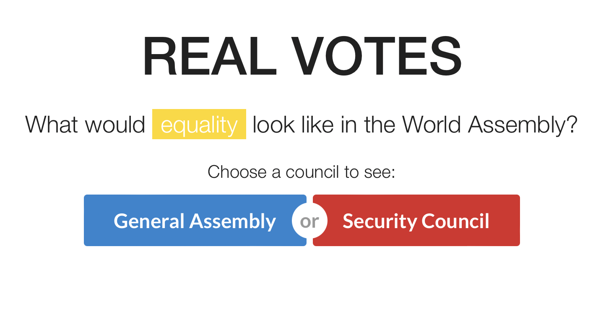
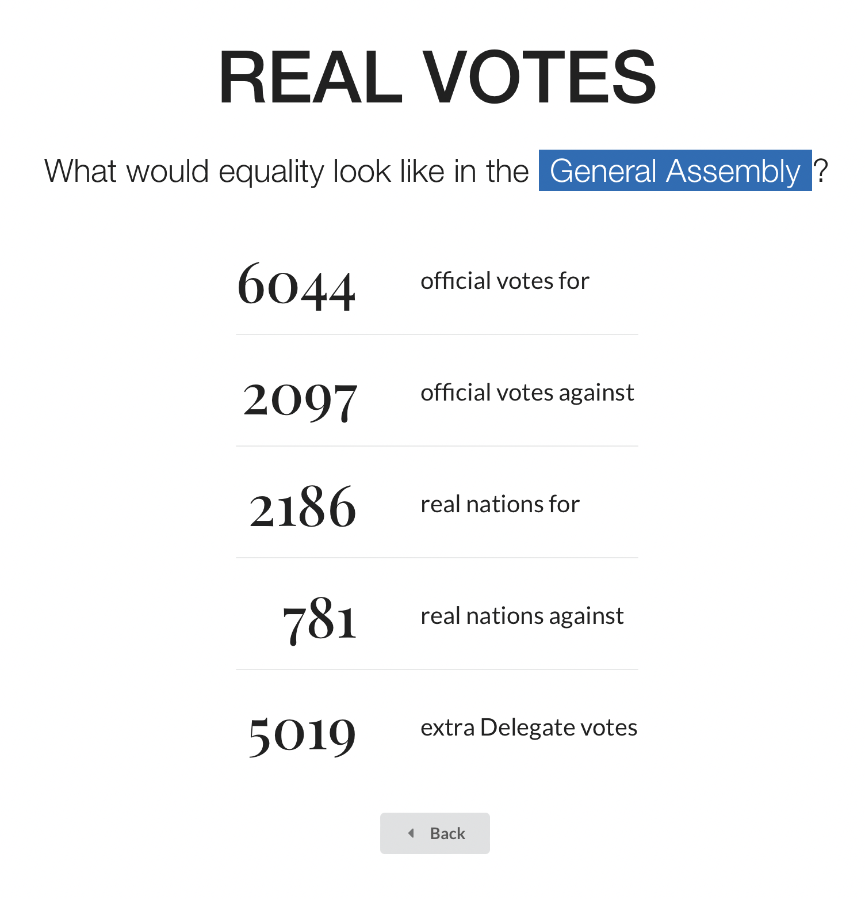

<div id="top"></div>

## Real Votes



**Real Votes** is a simple Node-based app that scrapes NationStates, does a little math behind the scenes, and shows what NationStates World Assembly votes would look like if everybody had only one vote.

<p align="right">(<a href="#top">back to top</a>)</p>


### Built With

* [Node.js](https://nodejs.org/)
* [EJS](https://ejs.co/)
* [Semantic UI](http://semantic-ui.com)
* [NationStates](https://nationstates.net/)


<p align="right">(<a href="#top">back to top</a>)</p>


## Getting Started

This is an example of how you may give instructions on setting up your project locally.
To get a local copy up and running follow these simple example steps.

### Prerequisites

To run your own copy of Real Votes, you need a webserver with Node and npm installed.

* nodejs
  ```sh
  brew install node
  ```
* npm
  ```sh
  npm install npm@latest -g
  ```

### Installation

1. Clone the repo
  ```sh
  git clone https://github.com/hierocles/ns-realvotes
  ```
2. Install npm packages
  ```sh
  npm install
  ```
3. Rename `.env.example` and edit port and UserAgent settings
  ```sh
  mv .env.example .env
  ```
4. Start `index.js`

<p align="right">(<a href="#top">back to top</a>)</p>


<!-- USAGE EXAMPLES -->
## Usage

Load up Real Votes and from the index page, you can select General Assembly or Security Council. If a vote is currently active, you'll be given a breakdown of the vote count and what it would be sans the extra Delegate votes.



<p align="right">(<a href="#top">back to top</a>)</p>


<!-- CONTRIBUTING -->
## Contributing

If you have a suggestion that would make this better, please fork the repo and create a pull request. You can also simply open an issue with the tag "enhancement".

1. Fork the Project
2. Create your Feature Branch (`git checkout -b feature/AmazingFeature`)
3. Commit your Changes (`git commit -m 'Add some AmazingFeature'`)
4. Push to the Branch (`git push origin feature/AmazingFeature`)
5. Open a Pull Request

<p align="right">(<a href="#top">back to top</a>)</p>


<!-- LICENSE -->
## License

Distributed under the AGPL-3.0 License. See `LICENSE.txt` for more information.

<p align="right">(<a href="#top">back to top</a>)</p>


[product-screenshot]: screenshot1.png
[product-screenshot2]: screenshot2.png 